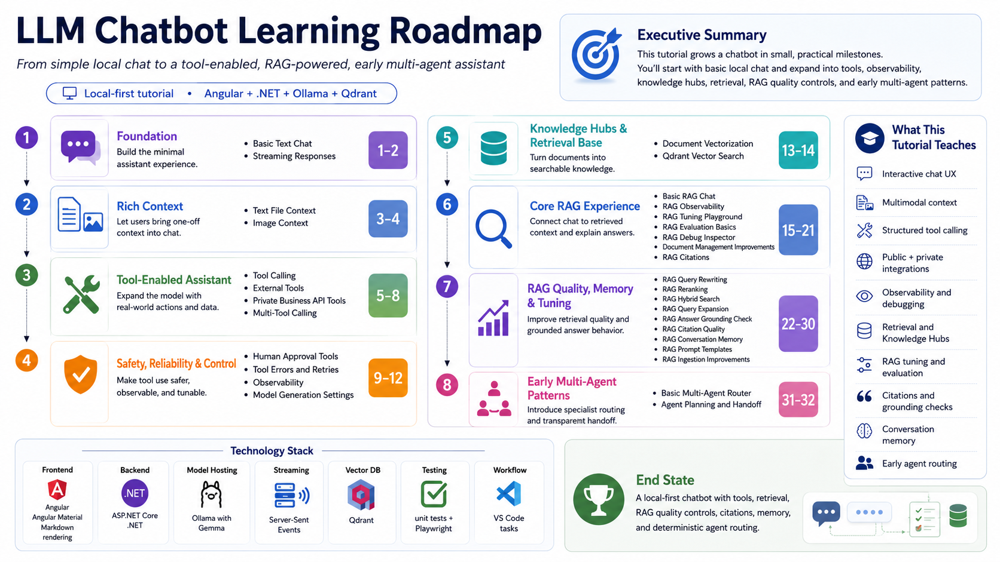

# Chat to RAG to Agents

> A milestone-based, local-first learning journey for building a modern LLM-powered chatbot—from basic text chat to tools, retrieval-augmented generation, quality controls, memory, and early multi-agent patterns.

<a href="https://markdownstudio.anglebrackets.app/?github=https://github.com/ranjanmadhu/chat-to-rag-to-agents/tree/main/docs" target="_blank" rel="noopener noreferrer">Open This Docs Hub in Markdown Studio</a>

## Quick Start

Use these commands for a first run on Windows or macOS.

Windows (PowerShell):

	winget install Microsoft.DotNet.SDK.10
	winget install OpenJS.NodeJS.LTS
	winget install Ollama.Ollama
	dotnet restore Chatbot.sln
	cd frontend/chatbot-ui && npm install && cd ../..
	node scripts/setup-ollama.mjs
	node scripts/start-dev-stack.mjs

macOS (Homebrew):

	brew install --cask dotnet-sdk
	brew install node
	brew install ollama
	dotnet restore Chatbot.sln
	cd frontend/chatbot-ui && npm install && cd ../..
	node scripts/setup-ollama.mjs
	node scripts/start-dev-stack.mjs

Open:

1. Frontend: http://localhost:4200
2. API Swagger: http://localhost:5273/swagger

Stop everything:

	node scripts/stop-dev-stack.mjs

## Overview

This repository demonstrates how an LLM-powered chatbot can evolve through small, reviewable milestones.

The journey begins with a basic locally hosted chatbot and progressively introduces capabilities commonly required in modern AI-enabled products:

* Streaming responses
* Markdown answer rendering
* Text-file and image context
* Model-selected tool calling
* Public and private API integrations
* Multi-tool orchestration
* Human approval for sensitive operations
* Tool retries, error handling, and observability
* Knowledge Hubs
* Document chunking and vectorization
* Qdrant-backed vector search
* Retrieval-augmented generation
* Retrieval tuning and evaluation
* Citations and grounding checks
* Conversation memory
* Prompt and ingestion controls
* Basic agent routing and handoff

The objective is not only to build a chatbot. It is to understand how each capability changes the product architecture, user experience, reliability model, and engineering responsibilities.

## Learning Roadmap

| Phase | Phase Definition | Milestone | Capability | Learning Guide | Status |
| --- | --- | --- | --- | --- | --- |
| Phase 1 - Foundation | Build the smallest useful chatbot and improve responsiveness with streaming and cancellation. | 01 | Basic Text Chat | [Learning Guide 01](./learning-guide-01-foundation-chat-and-streaming.md) | Published |
|  |  | 02 | Streaming Responses | [Learning Guide 01](./learning-guide-01-foundation-chat-and-streaming.md) | Published |
|  |  | 02A | Provider Switching with Gemini | [Learning Guide 02](./learning-guide-02-provider-switching-and-gemini.md) | Published |
|  |  | 02B | Azure Deployment, Runtime Injection, and Safe Confirmation | [Learning Guide 02B](./learning-guide-02b-azure-deployment-and-safe-confirmation.md) | Published |
|  |  | 02C | Ollama Model Management, Warmup, and Dynamic Capabilities | [Learning Guide 02C](./learning-guide-02c-ollama-model-management-warmup-and-capabilities.md) | Published |
| Phase 2 - Rich Context | Add one-off text, code, structured files, and image context to chat requests. | 03 | Text File Context | [Learning Guide 03](./learning-guide-03-text-file-context.md) | Published |
|  |  | 04 | Image Context | TBD | Planned |
| Phase 3 - Tool-Enabled Assistant | Move beyond text generation by allowing model-selected structured tool usage. | 05 | Tool Calling | TBD | Planned |
|  |  | 06 | External Tools | TBD | Planned |
|  |  | 07 | Private Business API Tools | TBD | Planned |
|  |  | 08 | Multi-Tool Calling | TBD | Planned |
| Phase 4 - Safety, Reliability, and Control | Introduce approval boundaries, retries, observability, and generation controls. | 09 | Human Approval Tools | TBD | Planned |
|  |  | 10 | Tool Errors and Retries | TBD | Planned |
|  |  | 11 | Observability | TBD | Planned |
|  |  | 12 | Model Generation Settings | TBD | Planned |
| Phase 5 - Knowledge Hubs and Retrieval | Create reusable document collections, chunk/vectorize content, and inspect semantic search. | 13 | Document Vectorization | TBD | Planned |
|  |  | 14 | Qdrant Vector Search | TBD | Planned |
| Phase 6 - Core RAG Experience | Connect retrieval to chat, inspect context, evaluate retrieval, and add citations. | 15 | Basic RAG Chat | TBD | Planned |
|  |  | 16 | RAG Observability | TBD | Planned |
|  |  | 17 | RAG Tuning Playground | TBD | Planned |
|  |  | 18 | RAG Evaluation Basics | TBD | Planned |
|  |  | 19 | RAG Debug Inspector | TBD | Planned |
|  |  | 20 | Document Management Improvements | TBD | Planned |
|  |  | 21 | RAG Citations | TBD | Planned |
| Phase 7 - RAG Quality, Memory, and Tuning | Improve recall, ranking, grounding, citation quality, follow-up memory, and prompt control. | 22 | RAG Query Rewriting | TBD | Planned |
|  |  | 23 | RAG Reranking | TBD | Planned |
|  |  | 24 | RAG Hybrid Search | TBD | Planned |
|  |  | 25 | RAG Query Expansion | TBD | Planned |
|  |  | 26 | RAG Answer Grounding Check | TBD | Planned |
|  |  | 27 | RAG Citation Quality | TBD | Planned |
|  |  | 28 | RAG Conversation Memory | TBD | Planned |
|  |  | 29 | RAG Prompt Templates | TBD | Planned |
|  |  | 30 | RAG Ingestion Improvements | TBD | Planned |
| Phase 8 - Early Multi-Agent Patterns | Introduce specialist routing, transparent planning, and controlled handoff. | 31 | Basic Multi-Agent Router | TBD | Planned |
|  |  | 32 | Agent Planning and Handoff | TBD | Planned |

Direct links for this stage:

1. [Learning Guide 02](./learning-guide-02-provider-switching-and-gemini.md)
2. [Learning Guide 02B](./learning-guide-02b-azure-deployment-and-safe-confirmation.md)
3. [Learning Guide 02C](./learning-guide-02c-ollama-model-management-warmup-and-capabilities.md)
4. [Learning Guide 03](./learning-guide-03-text-file-context.md)

## What You Will Learn

By following the milestones, you will learn how to:

* Build a full-stack LLM chat experience
* Stream model responses using Server-Sent Events
* Switch between local and hosted model providers
* Handle text and image context
* Render model output safely as Markdown
* Define and invoke structured tools
* Integrate public and private APIs
* Orchestrate multiple tool calls
* Introduce human approval for sensitive operations
* Capture tool failures, retries, timings, and outputs
* Tune model-generation settings
* Create reusable document collections
* Chunk, embed, and vectorize documents
* Perform semantic search using Qdrant
* Build and inspect a RAG pipeline
* Tune retrieval behavior
* Evaluate retrieval quality
* Add citations and grounding checks
* Support conversational follow-up questions
* Route requests to specialist agent profiles
* Expose planning and handoff metadata without exposing hidden model reasoning

## Technology Stack

| Area                 | Technology                                                            |
| -------------------- | --------------------------------------------------------------------- |
| Frontend             | Angular, Angular Material, Markdown rendering                         |
| Backend              | ASP.NET Core, .NET                                                    |
| Model providers      | Ollama with Gemma, Google Gemini API                                  |
| Streaming            | Server-Sent Events                                                    |
| Vector database      | Qdrant                                                                |
| Testing              | Backend unit tests, frontend unit tests, Playwright                   |
| Development workflow | VS Code tasks and local scripts                                       |
| Documentation        | Markdown guides, Git tags, releases, screenshots, and learning assets |

The application is designed around interfaces for model and vector-store access.

Ollama and Qdrant are used for the local tutorial, and Gemini demonstrates how the same chat experience can call a hosted model provider without requiring a complete rewrite of the product experience.

## Run the Application Locally

### Prerequisites

Install the following tools before running the app:

1. .NET SDK 10 (required for backend projects targeting net10.0)
2. Node.js version 22.22.3 or newer (or Node 24.15.0+)
3. npm (comes with Node.js)
4. Ollama

Recommended on Windows using winget:

	winget install Microsoft.DotNet.SDK.10
	winget install OpenJS.NodeJS.LTS
	winget install Ollama.Ollama

Recommended on macOS using Homebrew:

	brew install --cask dotnet-sdk
	brew install node
	brew install ollama

Verify installation:

	dotnet --list-sdks
	node -v
	npm -v
	ollama --version

### Install Repository Dependencies

From the repository root:

	dotnet restore Chatbot.sln
	cd frontend/chatbot-ui
	npm install
	cd ../..

### Set Up Ollama and Models

The repository includes a setup script that:

1. Installs Ollama if it is missing (Windows)
2. Starts Ollama if it is not running
3. Pulls the configured model and tutorial model set if they are not present

Run from repository root:

	node scripts/setup-ollama.mjs

By default, it checks the model configured in backend/src/Chatbot.Api/appsettings.json and also pulls the tutorial baseline set used in this stage:

1. deepseek-r1:1.5b
2. gemma2:2b
3. phi3:mini
4. llama3.2:1b
5. llama3.2:3b
6. nomic-embed-text:latest

You can also provide models explicitly:

	node scripts/setup-ollama.mjs gemma3:4b nomic-embed-text:latest

### Configure Gemini API (Optional)

Gemini is optional. Use it when you want to compare the local Ollama path with a hosted model provider.

Create a `.env` file in the repository root. You can start from `.env.example`:

	LLM_PROVIDER=gemini
	ENABLED_PROVIDERS=gemini,ollama
	GEMINI_API_KEY=your-google-ai-studio-api-key
	GEMINI_MODEL=gemini-3.6-flash

Runtime behavior:

1. `LLM_PROVIDER=gemini` makes Gemini the backend default when the request does not specify a provider.
2. `ENABLED_PROVIDERS=gemini,ollama` allows both providers locally.
3. For cloud demo environments where Ollama is disabled, set `ENABLED_PROVIDERS=gemini`.
4. The frontend provider picker sends `ollama` or `gemini` per request, so you can compare providers without restarting the UI.

The backend reads Gemini settings from `.env`, environment variables, or `backend/src/Chatbot.Api/appsettings.json`.

Gemini setup references:

1. Gemini API docs: https://ai.google.dev/api/generate-content
2. Google AI Studio API key setup: https://aistudio.google.com/app/apikey

### Start the Full Development Stack

From the repository root:

	node scripts/start-dev-stack.mjs

This starts:

1. Ollama (if needed)
2. Backend API on http://localhost:5273
3. Angular frontend on http://localhost:4200

Open:

1. Frontend: http://localhost:4200
2. API Swagger: http://localhost:5273/swagger

To stop all started processes:

	node scripts/stop-dev-stack.mjs

### Start Services Manually (Optional)

If you prefer separate terminals:

Terminal 1 (Ollama):

	ollama serve

Terminal 2 (Backend):

	dotnet run --project backend/src/Chatbot.Api/Chatbot.Api.csproj --launch-profile http

Terminal 3 (Frontend):

	cd frontend/chatbot-ui
	npm start

## Deploy to Azure (Ultra-Low-Cost Dev-Demo)

This repository includes script-first Azure deployment with a dev-demo default cost profile:

1. Static Web Apps Free for frontend
2. App Service Free (F1) for backend
3. Gemini default and Ollama disabled in deployed app settings
4. Fixed resource group name: `rg-chatbot-dev` by default
5. Stable app resource names derived from your subscription id by default
6. Infrastructure deployment is skipped when the existing resources already match the current template state

Prerequisites:

1. Azure CLI (`az`)
2. Active Azure login (`az login`) with the subscription you want selected
3. .NET SDK 10
4. Node.js and npm
5. PowerShell

From repository root:

	powershell -ExecutionPolicy Bypass -File .\scripts\azure\deploy.ps1 -EnvironmentName dev -Location westeurope

Optional custom resource group:

	powershell -ExecutionPolicy Bypass -File .\scripts\azure\deploy.ps1 -ResourceGroupName rg-chatbot-dev -EnvironmentName dev -Location westeurope

Teardown for a fresh redeploy (deletes resource group and everything inside it):

	powershell -ExecutionPolicy Bypass -File .\scripts\azure\teardown.ps1 -ResourceGroupName rg-chatbot-dev -Force

Gemini API key resolution order during deployment:

1. `-GeminiApiKey` parameter if provided
2. `GEMINI_API_KEY` in the repository `.env` file
3. Interactive secure prompt

Infrastructure deployment behavior:

1. The script logs the active Azure subscription name, id, and tenant id.
2. The script shows a deployment summary and waits for you to type `CONTINUE` before any Azure changes are made.
3. The script reuses `rg-chatbot-dev` by default if it already exists.
4. Backend and frontend resource names use a stable subscription-derived suffix by default to avoid global Azure name collisions.
5. If the expected Azure resources already exist and the infra template state has not changed, the script skips infrastructure deployment and only deploys backend/frontend code.
6. Use `-ForceInfrastructureDeployment` if you want to re-run infrastructure deployment explicitly.
7. The frontend build is injected with the deployed backend API base URL so requests do not go to Static Web Apps `/api`.
8. Backend CORS is configured during deployment to allow `https://<static-web-app-host>` and `http://localhost:4200`.

Deployed API quick checks:

1. `https://<backend-host>/` returns service metadata.
2. `https://<backend-host>/healthz` returns health status.
3. `https://<backend-host>/api/chat` expects POST; GET returns 405 by design.

You can also run the VS Code task:

1. Task: `Deploy Azure (dev-demo)`
2. Task: `Teardown Azure (dev-demo)`

For deployment details and profile behavior, see:

1. [azure-deployment-plan.md](azure-deployment-plan.md)
2. [scripts/azure/README.md](../scripts/azure/README.md)
3. [learning-guide-02-provider-switching-and-gemini.md](./learning-guide-02-provider-switching-and-gemini.md)
4. [learning-guide-02b-azure-deployment-and-safe-confirmation.md](./learning-guide-02b-azure-deployment-and-safe-confirmation.md)

### Common Troubleshooting

1. Error NETSDK1045 (targeting net10.0 with older SDK)
   Install .NET 10 SDK and confirm it appears in dotnet --list-sdks.

2. Angular CLI Node version error
   Upgrade Node.js to a supported version (for example 24.15.0).

3. Ollama model not found
   Pull the configured model in backend/src/Chatbot.Api/appsettings.json, for example:

	   ollama pull gemma3:4b

4. First message works, later messages time out
   Increase Ollama request timeout in backend/src/Chatbot.Api/appsettings.json:

	   "Ollama": {
		 "BaseUrl": "http://localhost:11434",
		 "ChatModel": "gemma3:4b",
		 "RequestTimeoutSeconds": 300
	   }

5. Gemini API key is not configured
   Add `GEMINI_API_KEY` to `.env` or set `Gemini__ApiKey` as an environment variable, then restart the backend.

6. Gemini response streams but metrics are missing
   Restart the backend after pulling the latest code. Gemini metrics are read from `usageMetadata` and sent on the final SSE `done` event.

7. Gemini model unavailable or unauthorized
   Check that `GEMINI_MODEL` is available for your API key and account. Try `gemini-3.6-flash` first.

---

If this repository helps you understand how modern LLM applications evolve from chat to RAG and agents, consider starring the repository and sharing what you learned.
