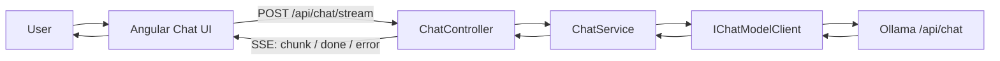
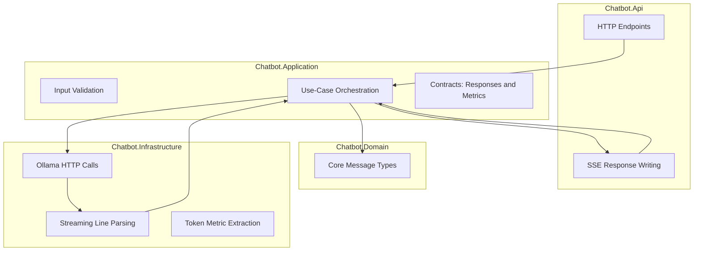
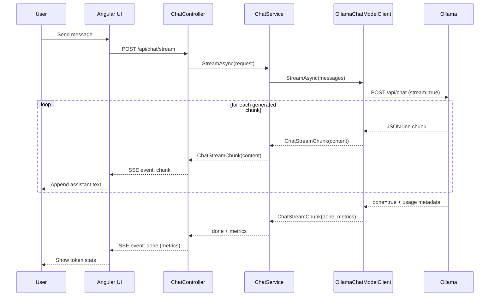

# Learning Guide 01: Foundation Chat, Streaming, and Token Metrics

This is the first core learning module for the repository. It explains both the concepts and the implementation for a local-first chatbot that streams responses and shows basic token performance data.

If you are starting your journey from chat to RAG to agents, begin here.

## 1. Why This Stage Matters

Many AI demos look impressive but skip the architectural boundaries you need in a real product. This stage intentionally keeps features minimal while introducing production-shaping decisions:

1. Frontend and model provider are decoupled through a backend API boundary.
2. Responses are streamed incrementally for better UX.
3. Basic model-performance metrics are captured and displayed.
4. Provider-specific protocol details are isolated in Infrastructure.

If you understand this stage deeply, the later stages (tools, retrieval, agents) become extensions rather than rewrites.

## 2. Learning Outcomes

By the end of this guide, you should be able to explain:

1. Why the backend uses Api, Application, Domain, and Infrastructure projects.
2. How a single user message becomes streaming assistant output.
3. Why SSE is used and what events are emitted.
4. How token metrics are calculated from Ollama metadata.
5. Which files to change when adding features safely.

## 3. Big Picture Architecture



Key principle: the UI never talks directly to Ollama. The backend is the control plane for validation, policy, diagnostics, and provider abstraction.

## 4. Repository Map for This Stage

### Backend

1. [backend/src/Chatbot.Api](../backend/src/Chatbot.Api)
2. [backend/src/Chatbot.Application](../backend/src/Chatbot.Application)
3. [backend/src/Chatbot.Domain](../backend/src/Chatbot.Domain)
4. [backend/src/Chatbot.Infrastructure](../backend/src/Chatbot.Infrastructure)

### Frontend

1. [frontend/chatbot-ui](../frontend/chatbot-ui)

### Scripts

1. [scripts/setup-ollama.mjs](../scripts/setup-ollama.mjs)
2. [scripts/start-dev-stack.mjs](../scripts/start-dev-stack.mjs)
3. [scripts/stop-dev-stack.mjs](../scripts/stop-dev-stack.mjs)

## 5. Layered Design and Responsibilities



Why this matters:

1. Api stays thin and transport-focused.
2. Application holds business behavior and flow.
3. Domain stays stable and provider-agnostic.
4. Infrastructure absorbs provider protocol changes.

## 6. Request Lifecycle: Step by Step

### 6.1 Streaming path used by UI



### 6.2 Non-stream fallback endpoint

You also keep `POST /api/chat` for regular one-shot completion and compatibility. This helps testing and incremental evolution.

## 7. SSE Protocol Used in This App

Events emitted by backend:

1. `chunk` with payload `{ content }`
2. `done` with payload `{ metrics }`
3. `error` with payload `{ error }`

Example frame format:

```text
event: chunk
data: {"content":"Hello"}

```

Why SSE here:

1. Native HTTP-friendly model for one-way server-to-client updates.
2. Easier debugging than bidirectional sockets at this stage.
3. Great fit for progressive token rendering.

## 8. Token Metrics: What They Mean

Displayed stats:

1. Input tokens
2. Output tokens
3. Output speed (tokens/sec)

Metadata source from Ollama response:

1. `prompt_eval_count`
2. `eval_count`
3. `eval_duration`

Computation:

$$
  ext{output tokens/sec} = \frac{\text{eval\_count}}{\text{eval\_duration (seconds)}}
$$

Interpretation tips:

1. Higher tokens/sec usually means faster generation, not necessarily better quality.
2. Prompt complexity and model size affect both speed and output quality.
3. Compare runs on the same machine/setup for meaningful trends.

## 9. Key Implementation Entry Points

### API and streaming

1. [backend/src/Chatbot.Api/Controllers/ChatController.cs](../backend/src/Chatbot.Api/Controllers/ChatController.cs)

### Application orchestration

1. [backend/src/Chatbot.Application/Chat/ChatService.cs](../backend/src/Chatbot.Application/Chat/ChatService.cs)
2. [backend/src/Chatbot.Application/Chat/IChatModelClient.cs](../backend/src/Chatbot.Application/Chat/IChatModelClient.cs)
3. [backend/src/Chatbot.Application/Chat/ChatMetrics.cs](../backend/src/Chatbot.Application/Chat/ChatMetrics.cs)

### Ollama provider integration

1. [backend/src/Chatbot.Infrastructure/Ollama/OllamaChatModelClient.cs](../backend/src/Chatbot.Infrastructure/Ollama/OllamaChatModelClient.cs)
2. [backend/src/Chatbot.Infrastructure/Ollama/OllamaOptions.cs](../backend/src/Chatbot.Infrastructure/Ollama/OllamaOptions.cs)
3. [backend/src/Chatbot.Infrastructure/DependencyInjection.cs](../backend/src/Chatbot.Infrastructure/DependencyInjection.cs)

### Frontend streaming and rendering

1. [frontend/chatbot-ui/src/app/chat-api.service.ts](../frontend/chatbot-ui/src/app/chat-api.service.ts)
2. [frontend/chatbot-ui/src/app/app.ts](../frontend/chatbot-ui/src/app/app.ts)
3. [frontend/chatbot-ui/src/app/app.html](../frontend/chatbot-ui/src/app/app.html)
4. [frontend/chatbot-ui/src/app/app.scss](../frontend/chatbot-ui/src/app/app.scss)

## 10. Configuration and Runtime Controls

Main runtime config:

1. [backend/src/Chatbot.Api/appsettings.json](../backend/src/Chatbot.Api/appsettings.json)

Relevant fields:

1. `Ollama:BaseUrl`
2. `Ollama:ChatModel`
3. `Ollama:RequestTimeoutSeconds`

Why timeout matters:

1. Local models can have variable latency.
2. Larger prompts or larger models increase response time.
3. A timeout too low can make first request pass and second request fail.

## 11. Operational Runbook

Use the run/setup instructions in [README.md](../README.md), then use this reliability sequence:

1. Run `node scripts/setup-ollama.mjs`.
2. Run `node scripts/start-dev-stack.mjs`.
3. Open frontend and send a short prompt first.
4. Increase prompt size gradually and observe metrics.
5. Stop with `node scripts/stop-dev-stack.mjs`.

## 12. Failure Modes and How to Diagnose

1. Message times out after one successful call.
   Cause: model latency exceeds timeout.
   Action: increase `RequestTimeoutSeconds` or use smaller model.

2. Model not found.
   Cause: configured tag not pulled.
   Action: run `ollama pull <exact-tag>` and retry.

3. Ollama unreachable.
   Cause: server not running or base URL mismatch.
   Action: start `ollama serve` and verify `Ollama:BaseUrl`.

4. Frontend appears to freeze while generating.
   Cause: no stream chunks arriving yet (slow first token).
   Action: check backend logs and model load behavior.

5. Large spacing in assistant markdown.
   Cause: markdown content + default paragraph/list spacing.
   Action: tune frontend markdown CSS spacing rules.

## 13. Why This Architecture Scales to Later Milestones

When you add tools, RAG, and agents:

1. Api remains HTTP and transport concerns.
2. Application grows orchestration logic and policies.
3. Infrastructure grows providers/adapters.
4. Frontend grows richer interaction patterns without provider coupling.

This avoids a rewrite trap where provider details leak into every layer.

## 14. Guided Practice Exercises

Use these exercises to internalize the design:

1. Change model tag and compare output speed and quality.
2. Lower timeout intentionally and observe fallback behavior.
3. Add one more metric field in backend and show it in frontend.
4. Add stream cancellation from UI and backend handling.
5. Compare non-stream endpoint and stream endpoint behavior with same prompt.

## 15. Self-Check Questions

If you can answer these, you are ready for the next module:

1. Why should UI call backend instead of Ollama directly?
2. What exactly does `done` event carry and why?
3. Where is provider-specific JSON parsing implemented?
4. Which layer should own timeout policy?
5. How would you swap Ollama for another provider with minimal changes?

## 16. Next Learning Module

Recommended next step:

1. [Learning Guide 02: Provider Switching with Gemini](learning-guide-02-provider-switching-and-gemini.md).
2. After that, move into the Rich Context phase with text-file input and image input.

Provider switching reinforces the boundary between Application and Infrastructure before the app starts carrying richer payloads. The Rich Context transition then teaches grounded prompting and payload shaping, which are prerequisites for tool-calling and retrieval workflows.

## 17. References and Further Reading

Use these references for Phase 1 only (foundation chat, streaming, and token metrics).

### Architecture and backend design

1. ASP.NET Core fundamentals: https://learn.microsoft.com/aspnet/core/fundamentals/
2. ASP.NET Core Web API overview: https://learn.microsoft.com/aspnet/core/web-api/
3. Dependency injection in ASP.NET Core: https://learn.microsoft.com/aspnet/core/fundamentals/dependency-injection

### Streaming and HTTP concepts

1. Server-Sent Events (MDN): https://developer.mozilla.org/docs/Web/API/Server-sent_events
2. Streams API (ReadableStream, browser): https://developer.mozilla.org/docs/Web/API/Streams_API
3. HTTP content negotiation and media types (MDN): https://developer.mozilla.org/docs/Web/HTTP/Content_negotiation

### Ollama and local model operations

1. Ollama docs (home): https://ollama.com/library
2. Ollama API reference: https://github.com/ollama/ollama/blob/main/docs/api.md
3. Ollama model management basics: https://github.com/ollama/ollama/blob/main/README.md

### Angular and frontend implementation

1. Angular HttpClient guide: https://angular.dev/guide/http
2. Angular signals guide: https://angular.dev/guide/signals
3. Angular forms guide: https://angular.dev/guide/forms

### LLM and token concepts

1. Tokenization overview (OpenAI tokenizer explainer): https://platform.openai.com/tokenizer
2. Latency optimization patterns for LLM apps: https://platform.openai.com/docs/guides/latency-optimization
3. Context windows and token limits (practical overview): https://docs.anthropic.com/en/docs/build-with-claude/context-windows

### Suggested reading order

1. Read ASP.NET Core Web API overview and SSE docs.
2. Read Ollama API docs and map fields to [backend/src/Chatbot.Infrastructure/Ollama/OllamaChatModelClient.cs](../backend/src/Chatbot.Infrastructure/Ollama/OllamaChatModelClient.cs).
3. Read Angular HttpClient + Streams API docs and map to [frontend/chatbot-ui/src/app/chat-api.service.ts](../frontend/chatbot-ui/src/app/chat-api.service.ts).
4. Read tokenization and latency references, then compare with metrics shown in the UI.
