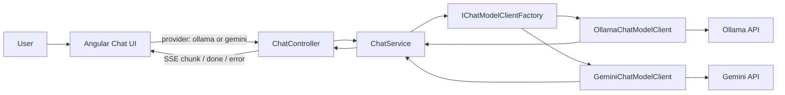

# Learning Guide 02: Provider Switching with Gemini

This guide explains how the chatbot now supports both a local provider (Ollama) and a hosted provider (Google Gemini) through the same backend and frontend flow.

The goal is not just to call another API. The goal is to learn how to introduce a new model provider without leaking provider-specific request formats, streaming formats, API keys, or token metadata into the whole application.

## 1. Why This Stage Matters

Real AI products often need more than one model provider:

1. Local models are useful for privacy, learning, and offline experimentation.
2. Hosted models are useful for quality, speed, larger context windows, and managed infrastructure.
3. Provider APIs differ in request shape, streaming protocol, error behavior, and usage metadata.
4. A clean provider boundary lets the UI and application logic stay stable while Infrastructure changes.

In this milestone, Gemini is added as a second chat provider while preserving the existing user experience.

## 2. Learning Outcomes

By the end of this guide, you should be able to explain:

1. How the provider dropdown reaches the backend request.
2. How `ChatService` resolves a provider without knowing provider HTTP details.
3. Why Ollama and Gemini need separate infrastructure clients.
4. How Gemini streaming differs from Ollama streaming.
5. How token metrics are normalized into the shared `ChatMetrics` contract.

## 3. Big Picture Architecture



Key principle: provider selection is a request-level choice, but provider protocol handling stays inside Infrastructure.

## 4. Repository Map for This Stage

### Backend contracts

1. [backend/src/Chatbot.Application/Chat/ChatRequest.cs](../backend/src/Chatbot.Application/Chat/ChatRequest.cs)
2. [backend/src/Chatbot.Application/Chat/IChatModelClient.cs](../backend/src/Chatbot.Application/Chat/IChatModelClient.cs)
3. [backend/src/Chatbot.Application/Chat/IChatModelClientFactory.cs](../backend/src/Chatbot.Application/Chat/IChatModelClientFactory.cs)
4. [backend/src/Chatbot.Application/Chat/ChatMetrics.cs](../backend/src/Chatbot.Application/Chat/ChatMetrics.cs)

### Backend provider implementations

1. [backend/src/Chatbot.Infrastructure/Ollama/OllamaChatModelClient.cs](../backend/src/Chatbot.Infrastructure/Ollama/OllamaChatModelClient.cs)
2. [backend/src/Chatbot.Infrastructure/Gemini/GeminiChatModelClient.cs](../backend/src/Chatbot.Infrastructure/Gemini/GeminiChatModelClient.cs)
3. [backend/src/Chatbot.Infrastructure/ChatModelClientFactory.cs](../backend/src/Chatbot.Infrastructure/ChatModelClientFactory.cs)
4. [backend/src/Chatbot.Infrastructure/DependencyInjection.cs](../backend/src/Chatbot.Infrastructure/DependencyInjection.cs)

### Frontend provider selection

1. [frontend/chatbot-ui/src/app/app.html](../frontend/chatbot-ui/src/app/app.html)
2. [frontend/chatbot-ui/src/app/app.ts](../frontend/chatbot-ui/src/app/app.ts)
3. [frontend/chatbot-ui/src/app/chat-api.service.ts](../frontend/chatbot-ui/src/app/chat-api.service.ts)

### Configuration

1. [.env.example](../.env.example)
2. [backend/src/Chatbot.Api/appsettings.json](../backend/src/Chatbot.Api/appsettings.json)
3. [backend/src/Chatbot.Api/Program.cs](../backend/src/Chatbot.Api/Program.cs)

## 5. Provider Selection Flow

The frontend sends a request shaped like this:

```json
{
  "message": "Explain embeddings in one paragraph.",
  "provider": "gemini"
}
```

The flow is:

1. User selects `Ollama` or `Gemini` in the provider picker.
2. `App` stores the selected provider in a signal.
3. `ChatApiService.streamMessage` includes `provider` in the POST body.
4. `ChatService` validates the message and asks `IChatModelClientFactory` for the right client.
5. The selected infrastructure client calls its provider and returns normalized chunks.

This keeps provider branching out of the controller and out of the UI rendering code.

## 6. Backend Configuration

The backend supports provider defaults from appsettings and `.env`.

Example `.env`:

```text
LLM_PROVIDER=ollama
GEMINI_API_KEY=your-google-ai-studio-api-key
GEMINI_MODEL=gemini-2.0-flash
```

Relevant `appsettings.json` fields:

```json
{
  "LLMProvider": "ollama",
  "Ollama": {
    "BaseUrl": "http://localhost:11434",
    "ChatModel": "gemma3:4b",
    "RequestTimeoutSeconds": 300
  },
  "Gemini": {
    "Model": "gemini-2.0-flash",
    "BaseUrl": "https://generativelanguage.googleapis.com",
    "RequestTimeoutSeconds": 300
  }
}
```

Resolution order:

1. Explicit request provider from the UI.
2. `LLMProvider` / `LLM_PROVIDER` default.
3. Ollama fallback.

Gemini API key resolution supports:

1. `Gemini:ApiKey` from configuration.
2. `GEMINI_API_KEY`.
3. `GOOGLE_API_KEY`.
4. `Gemini__ApiKey`.

## 7. Gemini Request Shape

Ollama accepts chat messages with roles such as `user` and `assistant`.

Gemini uses a `contents` array with roles such as `user` and `model`. The Gemini client maps:

1. `assistant` to `model`
2. everything else to `user`

Simplified Gemini request:

```json
{
  "contents": [
    {
      "role": "user",
      "parts": [
        { "text": "Hello" }
      ]
    }
  ]
}
```

The provider adapter owns this translation. The rest of the app continues using the domain-level `ChatMessage`.

## 8. Streaming Differences: Ollama vs Gemini

Ollama streams newline-delimited JSON from `/api/chat`.

Gemini streams Server-Sent Events from `streamGenerateContent` when the request includes `alt=sse`.

Gemini stream request path:

```text
/v1beta/models/{model}:streamGenerateContent?key={apiKey}&alt=sse
```

Example Gemini stream frame:

```text
data: {"candidates":[{"content":{"parts":[{"text":"Hello"}]}}]}

```

The backend normalizes both providers into the same app-level stream:

1. `ChatStreamChunk(content)` for generated text.
2. `ChatStreamChunk(IsDone: true, Metrics: metrics)` when the provider completes.

The controller then emits the same frontend SSE events regardless of provider:

1. `chunk`
2. `done`
3. `error`

## 9. Token Metrics

The UI displays a shared metric row:

1. Input tokens
2. Output tokens
3. Output speed in tokens/sec

### Ollama metadata

Ollama returns:

1. `prompt_eval_count`
2. `eval_count`
3. `eval_duration`

Ollama speed is computed from provider-reported evaluation duration:

```text
eval_count / eval_duration_seconds
```

### Gemini metadata

Gemini returns usage metadata:

1. `usageMetadata.promptTokenCount`
2. `usageMetadata.candidatesTokenCount`
3. `usageMetadata.totalTokenCount`

Gemini does not return the same evaluation-duration field as Ollama, so speed is computed from backend elapsed request time:

```text
candidatesTokenCount / elapsed_request_seconds
```

This makes the metric useful for comparison, but it is not identical to Ollama's model-only generation speed. It includes hosted API latency and network overhead.

## 10. Error Handling

The Gemini client returns user-readable fallback messages for common configuration failures:

1. Missing API key.
2. Unauthorized API key.
3. Model not found or unavailable for the account.
4. Hosted API request timeout or network failure.

This mirrors the Ollama client pattern, where provider-specific failures are converted into assistant-visible guidance instead of crashing the UI.

## 11. Testing Strategy

The backend tests use a stub `HttpMessageHandler` to verify Gemini behavior without calling the real API.

Covered cases:

1. Non-stream Gemini request uses the expected endpoint and returns content.
2. Non-stream Gemini response maps `usageMetadata` to `ChatMetrics`.
3. Streaming Gemini request includes `alt=sse`.
4. Streaming Gemini parses `data:` frames and returns final metrics.

Run:

```bash
dotnet test Chatbot.sln
```

Frontend tests verify the app sends the selected provider through the streaming API service.

Run:

```bash
cd frontend/chatbot-ui
npm test -- --watch=false
```

## 12. Operational Runbook

From repository root:

```bash
cp .env.example .env
```

Edit `.env`:

```text
LLM_PROVIDER=ollama
GEMINI_API_KEY=your-google-ai-studio-api-key
GEMINI_MODEL=gemini-2.0-flash
```

Start the stack:

```bash
node scripts/start-dev-stack.mjs
```

Open:

1. Frontend: http://localhost:4200
2. API Swagger: http://localhost:5273/swagger

Try the same prompt with both providers and compare:

1. Response quality.
2. First-token latency.
3. Total response time.
4. Input token count.
5. Output token count.
6. Output tokens/sec.

## 13. Failure Modes and How to Diagnose

1. Gemini says the API key is not configured.
   Cause: backend process did not receive `GEMINI_API_KEY`.
   Action: add it to `.env` and restart the backend.

2. Gemini request fails with unauthorized.
   Cause: invalid key or key not enabled for the API.
   Action: create or verify the key in Google AI Studio.

3. Gemini model is unavailable.
   Cause: configured model is not available for your account or API version.
   Action: set `GEMINI_MODEL=gemini-2.0-flash` and retry.

4. Gemini streams content but no metrics appear.
   Cause: backend was not restarted after the metrics change, or the provider did not return `usageMetadata`.
   Action: restart backend and inspect backend logs.

5. Provider picker appears ignored.
   Cause: stale frontend bundle or backend process.
   Action: restart the frontend dev server and backend API.

## 14. Guided Practice Exercises

1. Set `LLM_PROVIDER=gemini`, restart the backend, and call `POST /api/chat` without a provider field.
2. Compare Gemini and Ollama metrics for the same short prompt.
3. Temporarily remove `GEMINI_API_KEY` and observe the fallback response.
4. Change `GEMINI_MODEL` to an unavailable value and inspect error behavior.
5. Add another provider name to the frontend dropdown and trace which backend files would need implementation.

## 15. Self-Check Questions

If you can answer these, you understand the provider abstraction:

1. Why should `ChatController` not switch directly on provider names?
2. Why does Gemini need role mapping from `assistant` to `model`?
3. Why does Gemini streaming require `alt=sse`?
4. Why are Gemini speed metrics not exactly equivalent to Ollama speed metrics?
5. Which files would you modify to add another hosted provider?

## 16. References and Further Reading

1. Gemini generate content API: https://ai.google.dev/api/generate-content
2. Gemini text generation guide: https://ai.google.dev/gemini-api/docs/text-generation
3. Google AI Studio API keys: https://aistudio.google.com/app/apikey
4. Server-Sent Events (MDN): https://developer.mozilla.org/docs/Web/API/Server-sent_events
5. ASP.NET Core dependency injection: https://learn.microsoft.com/aspnet/core/fundamentals/dependency-injection
6. Angular signals: https://angular.dev/guide/signals
