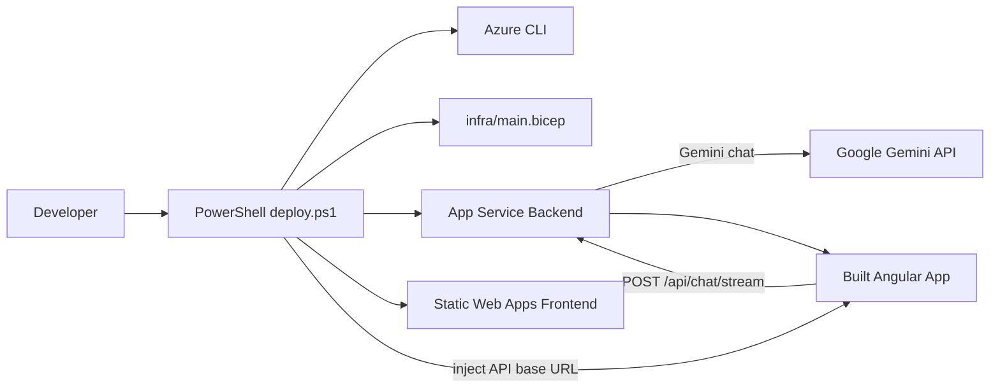

# Learning Guide 02B: Azure Deployment, Runtime Injection, and Safe Confirmation

This guide explains how the repository moves from local-first execution to an ultra-low-cost Azure deployment while keeping the same chat experience, provider defaults, and configuration model.

The goal is not only to deploy the app. The goal is to learn how to make deployment repeatable, safe, and low-cost without hardcoding subscription-specific values into the repository.

## 1. Why This Stage Matters

AI demos often fail in the last mile: the app works locally, but cloud deployment becomes brittle, expensive, or hard to repeat.

This stage addresses that by introducing a deployment flow that:

1. Uses a fixed low-cost profile for demos.
2. Keeps Gemini as the cloud default and disables Ollama in Azure.
3. Avoids hardcoded subscription IDs in checked-in code.
4. Injects the deployed backend URL into the frontend at deploy time.
5. Requires explicit human confirmation before Azure changes are made.

If you understand this stage, you can deploy the same codebase to another subscription without reworking the app itself.

## 2. Learning Outcomes

By the end of this guide, you should be able to explain:

1. Why Azure deployment is script-driven instead of manually assembled.
2. How the deployment script discovers the active subscription.
3. How the backend and frontend are configured differently in cloud versus local runs.
4. Why runtime frontend config injection is used instead of Angular environment file replacement.
5. How the confirmation gate reduces accidental infrastructure changes.
6. Which files control deployment behavior, rollback, and troubleshooting.

## 3. Big Picture Architecture



Key principle: deployment-time values belong in scripts and app settings, not in hardcoded source constants.

## 4. Repository Map for This Stage

### Deployment scripts

1. [scripts/azure/deploy.ps1](../scripts/azure/deploy.ps1)
2. [scripts/azure/deploy-backend.ps1](../scripts/azure/deploy-backend.ps1)
3. [scripts/azure/deploy-frontend.ps1](../scripts/azure/deploy-frontend.ps1)
4. [scripts/azure/teardown.ps1](../scripts/azure/teardown.ps1)
5. [scripts/azure/README.md](../scripts/azure/README.md)

### Infrastructure

1. [infra/main.bicep](../infra/main.bicep)
2. [docs/azure-deployment-plan.md](../docs/azure-deployment-plan.md)

### Application configuration

1. [backend/src/Chatbot.Api/Program.cs](../backend/src/Chatbot.Api/Program.cs)
2. [backend/src/Chatbot.Api/appsettings.json](../backend/src/Chatbot.Api/appsettings.json)
3. [frontend/chatbot-ui/src/index.html](../frontend/chatbot-ui/src/index.html)
4. [frontend/chatbot-ui/src/app/chat-api.service.ts](../frontend/chatbot-ui/src/app/chat-api.service.ts)

### User-facing documentation

1. [README.md](README.md)

## 5. Deployment Flow: Step by Step

The deploy flow is intentionally staged:

1. Read the active Azure subscription from the signed-in Azure CLI context.
2. Print the subscription name, subscription id, and tenant id.
3. Show a deployment summary with the resource group, app names, backend URL, and settings to be applied.
4. Pause and require the user to type `CONTINUE`.
5. Create or reuse the fixed resource group `rg-chatbot-dev`.
6. Derive a stable resource suffix from the subscription id when a custom suffix is not provided.
7. Deploy infrastructure only when the expected state has changed.
8. Apply backend app settings for Gemini-first Azure execution.
9. Publish the backend and deploy the frontend.
10. Validate the injected frontend runtime config after deployment.

This makes the deploy idempotent in practice for unchanged infrastructure and much safer for repeated demo updates.

## 6. Why These Azure Choices

The current cloud profile is intentionally minimal:

1. Static Web Apps Free for the frontend.
2. App Service Free F1 for the backend.
3. A resource group to hold the deployment.

Why this profile:

1. Very low baseline cost.
2. Easy to deploy from a developer workstation.
3. Good enough for demos and learning.

Tradeoffs:

1. Free tiers can sleep or throttle.
2. Startup latency is less predictable than production-grade SKUs.
3. It is not intended for high-availability workloads.

## 7. Configuration Model

### Local development

Use `.env` locally for convenience and keep secrets out of source control.

Typical values:

```text
LLM_PROVIDER=gemini
ENABLED_PROVIDERS=gemini,ollama
GEMINI_API_KEY=your-local-key
GEMINI_MODEL=gemini-3.6-flash
```

### Azure deployment

The deployment script applies Azure app settings so the deployed app behaves differently from local development:

1. `LLMProvider=gemini`
2. `LLM_PROVIDER=gemini`
3. `EnabledProviders=gemini`
4. `GEMINI_API_KEY=<deployed-secret>`
5. CORS origins for the deployed frontend host

Why this matters:

1. The cloud app should not try to use Ollama.
2. The same source code can support both local and cloud runs.
3. Secrets can be injected during deployment rather than committed.

## 8. Runtime Frontend Injection

The frontend is built once, then patched during deployment with the backend API base URL.

That is why the app uses a runtime placeholder in `index.html` rather than Angular environment file replacement.

Flow:

1. Build Angular frontend.
2. Replace the runtime placeholder with `https://<backend-host>/api`.
3. Deploy the built static assets.
4. Validate that the deployed HTML contains the expected assignment.

Why this approach is useful:

1. The same frontend build can be deployed to different environments.
2. The backend URL does not need to be compiled into the app.
3. The deploy script can verify the final deployed artifact directly.

## 9. Safe Confirmation Gate

The deployment script now requires an explicit confirmation step before any Azure changes occur.

The prompt is simple:

1. Review the printed deployment summary.
2. Type `CONTINUE` when you are ready.
3. Anything else cancels the run.

Why this matters:

1. It prevents accidental deployments to the wrong subscription.
2. It gives you a final checkpoint before resource creation or updates.
3. It makes the script safer to run from VS Code with multiple workspaces open.

This is a good pattern when a script can mutate cloud resources and is intended for repeated human-driven use.

## 10. Subscription Handling and Naming

This stage deliberately avoids hardcoding a subscription id into the repository.

Instead, the script:

1. Uses the active Azure login context by default.
2. Logs the subscription details before deployment.
3. Derives stable resource names from the active subscription id.
4. Allows a custom suffix only when explicitly requested.

That keeps the repository portable across contributors and subscriptions while still preventing naming collisions.

## 11. Teardown and Fresh Redeploys

When you want a completely clean redeploy, use the teardown script.

It deletes the resource group and everything inside it.

Why this exists:

1. Azure state can drift during experimentation.
2. Deleting only part of a demo environment is error-prone.
3. A full teardown is the fastest way to test a fresh end-to-end deploy.

Use it carefully, because it removes all resources in the group.

## 12. Key Implementation Entry Points

### Azure orchestration

1. [scripts/azure/deploy.ps1](../scripts/azure/deploy.ps1)
2. [scripts/azure/teardown.ps1](../scripts/azure/teardown.ps1)
3. [scripts/azure/deploy-frontend.ps1](../scripts/azure/deploy-frontend.ps1)
4. [scripts/azure/deploy-backend.ps1](../scripts/azure/deploy-backend.ps1)

### Azure infra and plan

1. [infra/main.bicep](../infra/main.bicep)
2. [docs/azure-deployment-plan.md](../docs/azure-deployment-plan.md)

### Runtime config and routing

1. [frontend/chatbot-ui/src/index.html](../frontend/chatbot-ui/src/index.html)
2. [frontend/chatbot-ui/src/app/chat-api.service.ts](../frontend/chatbot-ui/src/app/chat-api.service.ts)
3. [backend/src/Chatbot.Api/Program.cs](../backend/src/Chatbot.Api/Program.cs)

## 13. Operational Runbook

Use this sequence for local validation before deploying:

1. Run the app locally and verify Gemini works with your `.env` file.
2. Confirm the frontend can switch between providers locally if Ollama is enabled.
3. Review the deploy summary printed by `deploy.ps1`.
4. Type `CONTINUE` only after you confirm the target subscription and resource group.
5. After deploy, open the backend root and health endpoints.
6. Send a chat request from the frontend and confirm the request reaches the deployed backend.

## 14. Failure Modes and How to Diagnose

1. Deployment stops immediately.
   Cause: you did not type `CONTINUE`.
   Action: rerun the script and confirm the printed deployment summary.

2. Frontend sends requests to the wrong origin.
   Cause: runtime API base URL injection did not match the deployed backend host.
   Action: redeploy the frontend and check the post-deploy validation.

3. Backend returns 405 on a GET to `/api/chat`.
   Cause: the chat endpoint expects POST by design.
   Action: use the frontend or a POST request.

4. Gemini responses fail in Azure.
   Cause: API key, permissions, or quota issue.
   Action: check the backend logs and verify the key is valid for the deployed model.

5. Cloud app still tries to use Ollama.
   Cause: enabled provider list or app settings were not set for Gemini-only deployment.
   Action: verify `EnabledProviders=gemini` in App Service settings.

## 15. What to Remember

1. Deployments should be repeatable and safe by default.
2. Runtime configuration is often better than environment-file baking for frontend deployment targets.
3. Cloud defaults can differ from local defaults as long as the boundary is explicit.
4. Human confirmation is still valuable for destructive or expensive operations.
5. The right deployment shape is part of the product architecture, not just DevOps plumbing.
