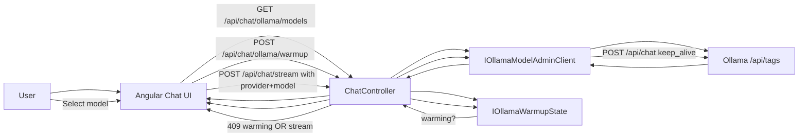

# Learning Guide 02C: Ollama Model Management, Warmup, and Dynamic Capabilities

This guide explains the next practical step after provider switching: selecting local models safely, warming them before use, and showing real capability metadata (text or image support) from Ollama.

The goal is not only to add a model dropdown. The goal is to make model switching reliable on constrained hardware and observable in the product UX.

## 1. Why This Stage Matters

Local-first AI apps often fail at the model lifecycle level:

1. The first request is slow because the model is cold.
2. Users switch models while requests are in flight.
3. UI shows static model labels that do not match what is actually installed.
4. Embedding-only models appear in chat pickers.

This stage addresses those issues with explicit warmup, request gating, and dynamic capability metadata.

## 2. Learning Outcomes

By the end of this guide, you should be able to explain:

1. How per-request model selection flows from UI to backend.
2. Why warmup is done before chat requests on model switch.
3. How server-side warmup state blocks conflicting requests.
4. How model capabilities are read from Ollama tags and reflected in UI labels.
5. How onboarding scripts pull a repeatable model set on a new machine.

## 3. Architecture Overview

Key principle: warmup is not just a frontend concern. The backend enforces warmup state too.

## 4. What Changed in Code

### Backend contracts and model metadata

1. [backend/src/Chatbot.Application/Chat/ChatRequest.cs](../backend/src/Chatbot.Application/Chat/ChatRequest.cs)
   Added optional model field.
2. [backend/src/Chatbot.Application/Chat/IChatModelClient.cs](../backend/src/Chatbot.Application/Chat/IChatModelClient.cs)
   Send and stream signatures now accept optional model.
3. [backend/src/Chatbot.Application/Chat/ChatMetrics.cs](../backend/src/Chatbot.Application/Chat/ChatMetrics.cs)
   Response/chunk metadata now carries model information.

### Backend model admin and warmup state

1. [backend/src/Chatbot.Infrastructure/Ollama/IOllamaModelAdminClient.cs](../backend/src/Chatbot.Infrastructure/Ollama/IOllamaModelAdminClient.cs)
   Exposes installed model metadata plus warmup operation.
2. [backend/src/Chatbot.Infrastructure/Ollama/OllamaModelAdminClient.cs](../backend/src/Chatbot.Infrastructure/Ollama/OllamaModelAdminClient.cs)
   Reads Ollama tags, maps capabilities, and performs warmup calls.
3. [backend/src/Chatbot.Infrastructure/Ollama/IOllamaWarmupState.cs](../backend/src/Chatbot.Infrastructure/Ollama/IOllamaWarmupState.cs)
   Tracks warming and ready state per model.
4. [backend/src/Chatbot.Infrastructure/DependencyInjection.cs](../backend/src/Chatbot.Infrastructure/DependencyInjection.cs)
   Registers warmup state and model admin services.

### API endpoints and request blocking

1. [backend/src/Chatbot.Api/Controllers/ChatController.cs](../backend/src/Chatbot.Api/Controllers/ChatController.cs)
   Added:
   - GET /api/chat/ollama/models
   - POST /api/chat/ollama/warmup
   Also:
   - blocks Ollama chat requests with HTTP 409 while model warmup is active
   - includes model in stream done payload

### Frontend model picker and blocking UX

1. [frontend/chatbot-ui/src/app/chat-api.service.ts](../frontend/chatbot-ui/src/app/chat-api.service.ts)
   Added model list and warmup API calls, better API-base fallback handling.
2. [frontend/chatbot-ui/src/app/app.ts](../frontend/chatbot-ui/src/app/app.ts)
   Added model switching workflow, warmup gate, and session reset on provider/model change.
3. [frontend/chatbot-ui/src/app/app.html](../frontend/chatbot-ui/src/app/app.html)
   Added model picker and disabled non-text options.
4. [frontend/chatbot-ui/src/app/app.scss](../frontend/chatbot-ui/src/app/app.scss)
   Added dropdown readability and warmup overlay styling.

## 5. Capability Mapping Logic

From Ollama tags:

1. supportsImage is true when capability includes vision.
2. supportsText is true when capability includes completion, tools, or thinking.
3. embedding-only models are shown but disabled for chat selection.

This avoids accidental selection of non-chat models while preserving transparency.

## 6. Warmup Behavior

Warmup request behavior:

1. UI posts selected model to /api/chat/ollama/warmup.
2. Backend marks model state as warming.
3. Backend performs a tiny Ollama chat call with keep_alive.
4. On success, state becomes ready and UI unlocks input.
5. If requests arrive while warming, backend returns HTTP 409 with status warming.

Why this helps:

1. Prevents race conditions during provider/model switch.
2. Reduces cold-start latency for first user query.
3. Keeps UX consistent even across tabs or concurrent clients.

## 7. Session Strategy on Model Change

Current UX rule:

1. Provider or model change starts a new chat session.
2. Existing messages are cleared after confirmation.
3. Sending is blocked while warmup is in progress.

Why:

1. Mixed-model history is confusing for evaluation.
2. Session boundaries make performance comparison easier.

## 8. Endpoints for Manual Validation

Use these checks while stack is running:

1. GET http://localhost:11434/api/tags
2. GET http://localhost:5273/api/chat/ollama/models
3. POST http://localhost:5273/api/chat/ollama/warmup

Expected:

1. Model list includes real supportsImage value for vision-capable models.
2. Embedding model has supportsText false.
3. Warmup endpoint returns ready status on success.

## 9. New Machine Onboarding

Will models be auto-pulled by app startup?

Short answer: no, not by backend/frontend startup alone.

What to run on a fresh machine:

1. Install prerequisites (.NET, Node, Ollama).
2. Run dependency restore/install.
3. Run:

   node scripts/setup-ollama.mjs

This setup script:

1. Ensures Ollama is installed (Windows path supported).
2. Starts Ollama if needed.
3. Pulls tutorial model set (unless already present):
   - deepseek-r1:1.5b
   - gemma2:2b
   - phi3:mini
   - llama3.2:1b
   - llama3.2:3b
   - nomic-embed-text:latest

Then run:

1. node scripts/start-dev-stack.mjs

## 10. Common Failure Modes

1. UI says unable to load models.
   Cause: backend API unavailable or wrong API base token.
   Action: start dev stack and verify /api routing.

2. 404 to placeholder API path.
   Cause: unresolved runtime base URL token.
   Action: ensure frontend resolves token placeholders to /api fallback.

3. Model names visible but unreadable in dropdown.
   Cause: native select option contrast issue in dark theme.
   Action: enforce option foreground/background for both themes.

4. Backend build lock errors during rerun.
   Cause: prior dotnet process still holding binaries.
   Action: stop running backend or use stop-dev-stack before restart.

## 11. Suggested Practice

1. Switch between llama3.2:1b and phi3:mini and compare warmup time.
2. Switch to gemma4:12b and verify text+image label appears.
3. Confirm embedding model remains disabled in chat picker.
4. Trigger a request during warmup and inspect HTTP 409 behavior.

## 12. What to Remember

1. Model switching is a lifecycle workflow, not just a dropdown event.
2. Warmup should be explicit and enforceable server-side.
3. Capability metadata must come from runtime source of truth when possible.
4. New-machine reproducibility depends on setup scripts, not assumptions.
