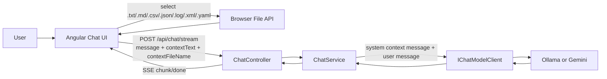

# Learning Guide 03: Text File Context for Grounded Chat

This guide explains the first milestone in Phase 2 (Rich Context): attaching one-off text files to a chat question so the model can answer with grounded context.

The goal is not just file upload UX. The goal is to add context in a way that is explicit, bounded, and portable across providers.

## 1. Why This Stage Matters

Pure prompt-only chat often fails in practical product workflows:

1. Users want answers based on their own notes, logs, snippets, or docs.
2. Without context, model answers can be generic or drift from source material.
3. Context needs clear limits, or payload size and latency can explode.
4. Context must work regardless of whether the selected provider is Ollama or Gemini.

This milestone solves that with request-scoped text context passed through the same backend chat API.

## 2. Learning Outcomes

By the end of this guide, you should be able to explain:

1. How text context moves from file picker to backend request payload.
2. Why context is attached as request data instead of stored server-side state.
3. How context size limits are enforced in both frontend and backend.
4. How the backend injects context into the model input safely and consistently.
5. How UI feedback communicates that context was attached to a user message.

## 3. Big Picture Flow



Key principle: context is request-scoped and explicit. It is not hidden session memory.

## 4. Repository Map for This Milestone

### Backend

1. [backend/src/Chatbot.Application/Chat/ChatRequest.cs](../backend/src/Chatbot.Application/Chat/ChatRequest.cs)
2. [backend/src/Chatbot.Application/Chat/ChatService.cs](../backend/src/Chatbot.Application/Chat/ChatService.cs)
3. [backend/src/Chatbot.Api/Controllers/ChatController.cs](../backend/src/Chatbot.Api/Controllers/ChatController.cs)

### Frontend

1. [frontend/chatbot-ui/src/app/chat-api.service.ts](../frontend/chatbot-ui/src/app/chat-api.service.ts)
2. [frontend/chatbot-ui/src/app/app.ts](../frontend/chatbot-ui/src/app/app.ts)
3. [frontend/chatbot-ui/src/app/app.html](../frontend/chatbot-ui/src/app/app.html)
4. [frontend/chatbot-ui/src/app/app.scss](../frontend/chatbot-ui/src/app/app.scss)

### Tests

1. [backend/tests/Chatbot.Tests/ChatServiceTests.cs](../backend/tests/Chatbot.Tests/ChatServiceTests.cs)

## 5. Request Contract Changes

`ChatRequest` now supports optional context fields:

1. `contextText`
2. `contextFileName`

The frontend sends these values for both regular and streaming requests.

Example request shape:

```json
{
  "message": "Summarize the launch plan.",
  "provider": "gemini",
  "model": "gemini-3.6-flash",
  "contextText": "Q3 roadmap: launch search and analytics",
  "contextFileName": "roadmap.txt"
}
```

## 6. Frontend Context Workflow

When a user attaches a file:

1. The hidden file input accepts text-like extensions and `text/*` MIME content.
2. The selected file is read using `file.text()`.
3. Content is trimmed.
4. Empty content is rejected with a user-visible error.
5. Content longer than 120,000 characters is rejected.
6. Valid context is kept in signals (`contextText`, `contextFileName`).

While context is active:

1. A context pill is shown above the composer.
2. User messages display a context chip showing the attached file name.
3. The same context is sent on each message until removed.

## 7. Backend Context Injection Strategy

In `ChatService`, message construction follows this rule:

1. If `ContextText` exists, add a `system` message first.
2. Append the trimmed user message as `user` role.

The injected system message uses this guidance pattern:

1. Use the provided context when answering.
2. If the answer is not in context, say so clearly.
3. Wrap context in `<context>...</context>` for structure.

This gives a consistent prompt scaffold for any provider implementation.

## 8. Size Limits and Validation

Current limit is 120,000 characters.

The same limit is enforced in both tiers:

1. Frontend prevents oversized files before request submission.
2. Backend re-validates and rejects oversized context with `ArgumentException`.

Why both checks matter:

1. Frontend validation improves UX and avoids unnecessary network calls.
2. Backend validation is required for trust boundaries and API safety.

## 9. Streaming Behavior with Context

Context does not change the SSE protocol. The stream still emits:

1. `chunk`
2. `done`
3. `error`

Only the model input changes (system + user messages instead of only user message).

That means existing streaming UI logic and metrics rendering continue to work without protocol changes.

## 10. Validation Endpoints and Quick Checks

Use these checks while the dev stack is running:

1. Open frontend: http://localhost:4200
2. Attach a small text file and send a question tied to file content.
3. Verify user bubble shows the file chip.
4. Remove context and resend the same question to compare behavior.
5. Attach a large file (>120,000 chars) and verify rejection message.

## 11. Failure Modes to Understand

1. Selected file appears to do nothing.
   Cause: file read failed in browser.
   Action: retry with a plain text file and check UI error message.

2. Backend returns bad request for context.
   Cause: context too large or malformed request payload.
   Action: reduce context size and confirm payload fields.

3. Model ignores parts of context.
   Cause: context length/quality or model behavior.
   Action: reduce noise, keep context focused, ask explicit grounded questions.

4. Wrong file name shown in chat chip.
   Cause: stale context signal from a previous selection.
   Action: remove context and reattach the intended file.

## 12. Design Tradeoffs in This Milestone

Why request-scoped context is a good first step:

1. Simple mental model: one explicit context payload per message flow.
2. No server-side persistence or lifecycle complexity.
3. Provider-agnostic and easy to test.

Known limitations:

1. No chunking, ranking, or semantic retrieval yet.
2. Large documents need manual trimming.
3. Context is reused until manually cleared.

These are intentional and set up later RAG milestones.

## 13. Suggested Practice

1. Attach release notes and ask for a risk summary grounded only in the file.
2. Attach a CSV snippet and ask for anomaly observations.
3. Compare Gemini vs Ollama responses using the same context.
4. Test with context removed to observe grounding impact.

## 14. What to Remember

1. Context should be explicit, bounded, and provider-agnostic.
2. Validate limits on both client and server.
3. Keep stream protocol stable while evolving model inputs.
4. This milestone is the bridge from plain chat to retrieval-oriented design.
