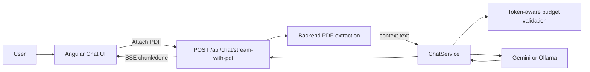

# Learning Guide 03A: PDF Context with Backend Upload and Token-Aware Budgeting

This guide explains the next Phase 2 milestone after text-file context: attaching PDF files directly to chat requests, extracting embedded text in the backend, and fitting context to model limits using token-aware budgeting.

The goal is not only PDF upload UX. The goal is to keep context handling safe, provider-aware, and extensible for OCR fallback in the next phase.

## 1. Why This Stage Matters

Text files are easy to read on the client, but PDF documents are different:

1. Parsing quality varies by file type and encoding.
2. Scanned PDFs may contain no embedded text.
3. Large documents can exceed practical model context budgets.
4. Context limits should adapt to provider and model, not rely on one hard cap.

This milestone introduces a backend-first PDF flow with model-aware budgeting.

## 2. Learning Outcomes

By the end of this guide, you should be able to explain:

1. Why PDF files are uploaded to the backend instead of pre-read in the browser.
2. How extracted PDF text is inserted into the existing context pipeline.
3. How token-aware budgeting differs from a fixed character limit.
4. How provider token counting falls back safely when unavailable.
5. How this design prepares for OCR integration without frontend contract changes.

## 3. Big Picture Flow

Key principle: the full PDF file is sent once to the backend, then converted to request-scoped context there.

## 4. What Changed in This Milestone

### Frontend

1. Added a dedicated PDF attach action in the composer.
2. Added a separate PDF context state and pill in the UI.
3. Added multipart streaming call for PDF chat requests.

### Backend

1. Added multipart streaming endpoint for chat with PDF upload.
2. Added PDF embedded-text extraction using a .NET PDF library.
3. Added shared token-aware context budgeting for provider/model.
4. Added fallback char-budget behavior when token counting is unavailable.

## 5. Repository Map for This Milestone

### Backend API

1. [backend/src/Chatbot.Api/Controllers/ChatController.cs](../backend/src/Chatbot.Api/Controllers/ChatController.cs)
2. [backend/src/Chatbot.Api/Chatbot.Api.csproj](../backend/src/Chatbot.Api/Chatbot.Api.csproj)
3. [backend/src/Chatbot.Api/appsettings.json](../backend/src/Chatbot.Api/appsettings.json)

### Application contracts and validation

1. [backend/src/Chatbot.Application/Chat/ChatService.cs](../backend/src/Chatbot.Application/Chat/ChatService.cs)
2. [backend/src/Chatbot.Application/Chat/IContextWindowBudgetResolver.cs](../backend/src/Chatbot.Application/Chat/IContextWindowBudgetResolver.cs)
3. [backend/src/Chatbot.Application/Chat/IContextTokenCounter.cs](../backend/src/Chatbot.Application/Chat/IContextTokenCounter.cs)

### Infrastructure budgeting and token counting

1. [backend/src/Chatbot.Infrastructure/Context/ContextWindowingOptions.cs](../backend/src/Chatbot.Infrastructure/Context/ContextWindowingOptions.cs)
2. [backend/src/Chatbot.Infrastructure/Context/ContextWindowBudgetResolver.cs](../backend/src/Chatbot.Infrastructure/Context/ContextWindowBudgetResolver.cs)
3. [backend/src/Chatbot.Infrastructure/Context/ProviderContextTokenCounter.cs](../backend/src/Chatbot.Infrastructure/Context/ProviderContextTokenCounter.cs)
4. [backend/src/Chatbot.Infrastructure/DependencyInjection.cs](../backend/src/Chatbot.Infrastructure/DependencyInjection.cs)

### Frontend

1. [frontend/chatbot-ui/src/app/app.html](../frontend/chatbot-ui/src/app/app.html)
2. [frontend/chatbot-ui/src/app/app.ts](../frontend/chatbot-ui/src/app/app.ts)
3. [frontend/chatbot-ui/src/app/chat-api.service.ts](../frontend/chatbot-ui/src/app/chat-api.service.ts)

## 6. API Endpoints and Contracts

### Streaming chat with PDF

Endpoint:

1. POST /api/chat/stream-with-pdf

Request:

1. multipart form data
2. message (required)
3. provider (optional)
4. model (optional)
5. pdfFile (required)
6. contextImagesJson (optional)

Response:

1. SSE stream using existing chunk and done events.

### Optional extraction endpoint

Endpoint:

1. POST /api/chat/context/pdf

Use case:

1. preview extraction behavior
2. diagnostics
3. UI workflows that need extraction metadata

## 7. PDF Extraction Strategy (Phase 1)

Current scope is embedded-text extraction only:

1. Accept .pdf uploads.
2. Parse pages and collect text segments.
3. Reject files that have no readable embedded text.
4. Return a clear message that OCR fallback is needed for scanned PDFs.

This keeps phase 1 lightweight and local-first.

## 8. Token-Aware Context Budgeting

Instead of one fixed max-context value, this milestone computes a budget per provider/model.

Core formula:

$$
usableTokens = \lfloor maxTokens \times safetyRatio \rfloor - reservedOutputTokens
$$

Then:

1. Validate context against usable token budget when token counting is available.
2. Fall back to a character budget when token counting is unavailable.

Benefits:

1. Better utilization for larger context-window models.
2. Safer behavior for smaller models.
3. More predictable response space by reserving output tokens.

## 9. Provider Token Counting

Current token counting strategy:

1. Gemini: countTokens API.
2. Ollama: tokenize API.
3. Fallback: character approximation path when APIs are unavailable.

This means the app is robust even when provider-side token counting is temporarily unavailable.

## 10. PDF Truncation Behavior

If extracted text exceeds token budget:

1. Backend trims context to fit the budget.
2. Trimming uses a token-aware fit strategy.
3. Warning metadata indicates truncation reason.

If token counting cannot be done:

1. Backend applies character fallback budget.
2. Warning metadata indicates fallback mode.

## 11. Configuration Knobs

Configure in appsettings under ContextWindowing:

1. SafetyRatio
2. ReservedOutputTokens
3. ApproxCharsPerToken
4. DefaultMaxContextTokens
5. GlobalMaxContextChars
6. MinContextChars
7. ModelLimits (provider/model-specific max token windows)

Practical defaults should prioritize stable output headroom over max raw context ingestion.

## 12. UX Behavior

Composer now supports separate attach actions:

1. Text file attach.
2. PDF attach.
3. Image attach.

When PDF is attached:

1. User message sends PDF as multipart to backend.
2. Context extraction stays backend-only.
3. Existing stream rendering and metrics UX are preserved.

## 13. Guardrails in This Milestone

1. PDF upload size limit.
2. Context budget enforcement by provider/model.
3. Clear user-visible errors for missing text or invalid PDF.
4. Fallback behavior instead of hard failure when token-counting APIs are unavailable.

## 14. Known Limitations

1. No OCR fallback yet.
2. Embedded-text quality depends on PDF source quality.
3. Context trimming is budget-driven, not semantic relevance-driven.

These are expected for phase 1 and keep implementation simple.

## 15. Roadmap to OCR (Next Phase)

Next phase can add OCR without changing frontend contract:

1. Keep sending PDF file to backend.
2. Attempt embedded-text extraction first.
3. If low/empty text, call OCR sidecar.
4. Merge and budget extracted text using the same context-budget pipeline.

Unlimited-OCR can be integrated in that fallback step as a separate service process.

## 16. Suggested Validation Checklist

1. Attach a text-heavy PDF and send a question grounded in PDF content.
2. Verify streaming behavior remains unchanged.
3. Test with a larger PDF and confirm truncation warning behavior.
4. Test with a scanned PDF and confirm clear OCR-needed message.
5. Compare behavior across Gemini and Ollama with different configured model limits.

## 17. What to Remember

1. Backend-first PDF handling is safer and more extensible than client-side parsing.
2. Token-aware budgets are essential for model portability.
3. Fallback behavior is a reliability feature, not a shortcut.
4. This milestone is the right foundation for OCR integration in the next phase.
