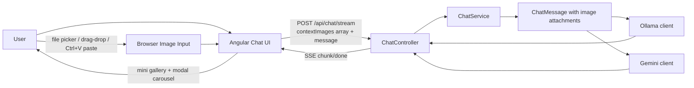

# Learning Guide 04: Image Context with Multi-Image Gallery and Fast Input

This guide explains the second milestone in Phase 2 (Rich Context): attaching images as one-off context, supporting multiple images per question, and enabling fast input through drag and paste.

The goal is not only image upload. The goal is to make multimodal context explicit, capability-aware, and easy to use in real chat workflows.

## 1. Why This Stage Matters

Single-text prompts are often insufficient for product workflows where users ask questions about screenshots, charts, diagrams, and photos.

Teams usually hit the same issues:

1. Image attach is too slow when file picker is the only input path.
2. One-image-only design breaks compare/contrast questions.
3. Users cannot verify what was actually attached.
4. Provider or model capability mismatches create confusing failures.

This milestone addresses those problems by adding multi-image context, gallery preview, dialog navigation, and fast attach methods.

## 2. Learning Outcomes

By the end of this guide, you should be able to explain:

1. How up to four images are attached and transmitted per message.
2. How provider and model capabilities gate image attach.
3. How drag-and-drop and clipboard paste reduce interaction cost.
4. How user-message galleries and modal navigation improve trust and reviewability.
5. How context is cleared after send so each new message starts clean.

## 3. Big Picture Flow

Key principle: image context is request-scoped and explicit, not hidden session memory.

## 4. Repository Map for This Milestone

### Backend contracts and validation

1. [backend/src/Chatbot.Application/Chat/ChatRequest.cs](../backend/src/Chatbot.Application/Chat/ChatRequest.cs)
2. [backend/src/Chatbot.Application/Chat/ChatService.cs](../backend/src/Chatbot.Application/Chat/ChatService.cs)
3. [backend/src/Chatbot.Domain/ChatMessage.cs](../backend/src/Chatbot.Domain/ChatMessage.cs)
4. [backend/src/Chatbot.Domain/ChatImageAttachment.cs](../backend/src/Chatbot.Domain/ChatImageAttachment.cs)

### Provider mapping

1. [backend/src/Chatbot.Infrastructure/Ollama/OllamaChatModelClient.cs](../backend/src/Chatbot.Infrastructure/Ollama/OllamaChatModelClient.cs)
2. [backend/src/Chatbot.Infrastructure/Gemini/GeminiChatModelClient.cs](../backend/src/Chatbot.Infrastructure/Gemini/GeminiChatModelClient.cs)

### Frontend interaction and rendering

1. [frontend/chatbot-ui/src/app/chat-api.service.ts](../frontend/chatbot-ui/src/app/chat-api.service.ts)
2. [frontend/chatbot-ui/src/app/app.ts](../frontend/chatbot-ui/src/app/app.ts)
3. [frontend/chatbot-ui/src/app/app.html](../frontend/chatbot-ui/src/app/app.html)
4. [frontend/chatbot-ui/src/app/app.scss](../frontend/chatbot-ui/src/app/app.scss)

### Tests

1. [backend/tests/Chatbot.Tests/ChatServiceTests.cs](../backend/tests/Chatbot.Tests/ChatServiceTests.cs)
2. [backend/tests/Chatbot.Tests/GeminiChatModelClientTests.cs](../backend/tests/Chatbot.Tests/GeminiChatModelClientTests.cs)
3. [frontend/chatbot-ui/src/app/app.spec.ts](../frontend/chatbot-ui/src/app/app.spec.ts)

## 5. Request Contract Design

Image context now supports an array payload:

1. ContextImages[] where each item includes base64, mimeType, and optional fileName.
2. Maximum of four images per request.
3. Legacy single-image fields remain available for compatibility.

Why this matters:

1. Multi-image prompts enable comparison tasks in one turn.
2. Compatibility allows gradual rollout without breaking existing clients.

## 6. Validation and Limits

Validation happens in ChatService before provider calls:

1. Image context must include both base64 and mime type.
2. Mime type must start with image/.
3. Each image must decode as valid base64.
4. Each image has a 5 MB decoded byte limit.
5. Total image count per message is limited to four.

Why both UX and backend checks are necessary:

1. Frontend checks prevent avoidable network calls.
2. Backend checks enforce trust boundaries and protect provider calls.

## 7. Provider Mapping Strategy

The same domain message is mapped differently per provider:

1. Ollama: user message images map to the images array in Ollama request payload.
2. Gemini: images map to inlineData parts alongside text parts.

This preserves a provider-agnostic application contract while handling protocol specifics in infrastructure.

## 8. Frontend Attach Paths

Users can attach images through three paths:

1. File picker with multi-select.
2. Drag-and-drop onto the composer.
3. Clipboard paste of image content.

Attach behavior:

1. Non-image files are ignored with clear feedback.
2. Attach is blocked when selected provider or model does not support image context.
3. The UI keeps a local image list for the current unsent message.

## 9. Composer and Context UX

The composer now includes:

1. Image count chip showing how many images are attached.
2. Per-image thumbnails with remove action.
3. Drag-over highlight when dropping files.

After message send:

1. Text context is cleared.
2. Image context is cleared.
3. The next message starts with no leftover attachments.

This keeps context explicit and prevents accidental carryover.

## 10. User Message Gallery and Modal Flow

When a user message includes images:

1. The bubble renders a mini gallery.
2. Clicking any image opens a modal at the clicked index.
3. Modal supports previous/next navigation.
4. Keyboard navigation supports Escape, ArrowLeft, and ArrowRight.
5. Thumbnail strip allows direct image selection.

Why this matters:

1. Users can verify exactly what was sent.
2. Multi-image review is fast without leaving the conversation.

## 11. Capability-Aware Behavior

Image attach controls are shown only when image context is supported:

1. Gemini path: enabled.
2. Ollama path: enabled only when the selected model reports image capability.

If support is not available:

1. Attach actions are blocked.
2. Existing attached image context is cleared when switching to unsupported model/provider.

## 12. Suggested Validation Checklist

Use this quick manual sequence:

1. Attach 2 to 4 images via picker and send one question.
2. Confirm user bubble shows mini gallery.
3. Open modal from second image and navigate left and right.
4. Paste an image with Ctrl+V into composer and verify attach.
5. Drag an image into composer and verify attach.
6. Confirm context is empty after sending.
7. Switch to an Ollama text-only model and verify image attach is blocked.

## 13. Failure Modes and Troubleshooting

1. Images do not attach on paste.
   Cause: clipboard does not contain image items.
   Action: copy actual image data, not file path text.

2. Attach fails after model switch.
   Cause: selected model does not support image context.
   Action: switch to a multimodal-capable model.

3. Provider rejects request with image payload.
   Cause: unsupported model, invalid mime/base64, or size over limit.
   Action: validate image format, size, and model capability.

4. Too many images attached.
   Cause: request exceeds four-image limit.
   Action: remove extra images before send.

## 14. Design Tradeoffs in This Milestone

Benefits:

1. Fast, practical multimodal input for real user workflows.
2. Better transparency through in-chat gallery and modal verification.
3. Provider-agnostic contracts with infrastructure-specific mapping.

Current tradeoffs:

1. Image preprocessing/compression is not automatic yet.
2. Total payload can still grow significantly with large images.
3. OCR and region-based grounding are out of scope for this milestone.

## 15. What to Remember

1. Multi-image context is explicit and bounded, not ambient memory.
2. Capability gating is essential for predictable UX.
3. Fast attach paths are as important as API correctness.
4. Visual verification in chat reduces user error and improves trust.
