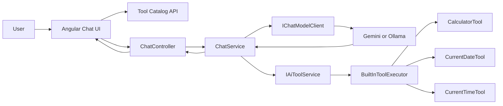

# Learning Guide 05: Tool Calling with Deterministic and AI-Selected Execution

This guide explains the first milestone in Phase 3 (Tool-Enabled Assistant): explicit tool discovery, user tool selection, deterministic execution, and AI-returned tool calls.

The focus is implementation: architecture, request and response contracts, execution flow, and validation.

## 1. Scope

This milestone implements:

1. Tool discovery endpoint for UI-driven tool selection.
2. Request-level allow-list via enabledToolIds.
3. Deterministic tools implemented as one class per tool.
4. AI tool-call parsing and execution through shared contracts.
5. usedToolId metadata in response and stream completion events.

## 2. Learning Outcomes

By the end of this guide, you should be able to explain:

1. How tools are discovered and returned by the API.
2. How user-selected tool IDs flow from UI to backend request.
3. How deterministic tool execution works from per-tool classes.
4. How AI-returned tool calls are parsed and executed.
5. How fallback behavior preserves usability when tool calls are absent.

## 3. Big Picture Flow



Key principle: keep provider protocol handling in provider clients, and keep tool logic in the tools layer.

## 4. Repository Map for This Milestone

### API and orchestration

1. [backend/src/Chatbot.Api/Controllers/ChatController.cs](../backend/src/Chatbot.Api/Controllers/ChatController.cs)
2. [backend/src/Chatbot.Application/Chat/ChatService.cs](../backend/src/Chatbot.Application/Chat/ChatService.cs)
3. [backend/src/Chatbot.Application/Chat/ChatRequest.cs](../backend/src/Chatbot.Application/Chat/ChatRequest.cs)
4. [backend/src/Chatbot.Application/Chat/ChatResponse.cs](../backend/src/Chatbot.Application/Chat/ChatResponse.cs)
5. [backend/src/Chatbot.Application/Chat/ChatMetrics.cs](../backend/src/Chatbot.Application/Chat/ChatMetrics.cs)

### Tool contracts and deterministic tools

1. [backend/src/Chatbot.Application/Chat/ChatToolDefinition.cs](../backend/src/Chatbot.Application/Chat/ChatToolDefinition.cs)
2. [backend/src/Chatbot.Application/Chat/BuiltInToolExecutor.cs](../backend/src/Chatbot.Application/Chat/BuiltInToolExecutor.cs)
3. [backend/src/Chatbot.Application/Tools/Deterministic/IDeterministicChatTool.cs](../backend/src/Chatbot.Application/Tools/Deterministic/IDeterministicChatTool.cs)
4. [backend/src/Chatbot.Application/Tools/Deterministic/CalculatorTool.cs](../backend/src/Chatbot.Application/Tools/Deterministic/CalculatorTool.cs)
5. [backend/src/Chatbot.Application/Tools/Deterministic/CurrentDateTool.cs](../backend/src/Chatbot.Application/Tools/Deterministic/CurrentDateTool.cs)
6. [backend/src/Chatbot.Application/Tools/Deterministic/CurrentTimeTool.cs](../backend/src/Chatbot.Application/Tools/Deterministic/CurrentTimeTool.cs)

### AI tool call contracts and execution

1. [backend/src/Chatbot.Application/Tools/AiToolContracts.cs](../backend/src/Chatbot.Application/Tools/AiToolContracts.cs)
2. [backend/src/Chatbot.Application/Tools/IAiToolService.cs](../backend/src/Chatbot.Application/Tools/IAiToolService.cs)
3. [backend/src/Chatbot.Application/Tools/IToolOrchestrator.cs](../backend/src/Chatbot.Application/Tools/IToolOrchestrator.cs)
4. [backend/src/Chatbot.Application/Tools/ToolOrchestrator.cs](../backend/src/Chatbot.Application/Tools/ToolOrchestrator.cs)
5. [backend/src/Chatbot.Application/Tools/SemanticKernelAiToolService.cs](../backend/src/Chatbot.Application/Tools/SemanticKernelAiToolService.cs)
6. [backend/src/Chatbot.Application/Tools/SystemToolsPlugin.cs](../backend/src/Chatbot.Application/Tools/SystemToolsPlugin.cs)

### Provider adapters and DI

1. [backend/src/Chatbot.Application/Chat/IChatModelClient.cs](../backend/src/Chatbot.Application/Chat/IChatModelClient.cs)
2. [backend/src/Chatbot.Infrastructure/Gemini/GeminiChatModelClient.cs](../backend/src/Chatbot.Infrastructure/Gemini/GeminiChatModelClient.cs)
3. [backend/src/Chatbot.Infrastructure/Ollama/OllamaChatModelClient.cs](../backend/src/Chatbot.Infrastructure/Ollama/OllamaChatModelClient.cs)
4. [backend/src/Chatbot.Infrastructure/DependencyInjection.cs](../backend/src/Chatbot.Infrastructure/DependencyInjection.cs)

### Frontend tool UX

1. [frontend/chatbot-ui/src/app/chat-api.service.ts](../frontend/chatbot-ui/src/app/chat-api.service.ts)
2. [frontend/chatbot-ui/src/app/app.ts](../frontend/chatbot-ui/src/app/app.ts)
3. [frontend/chatbot-ui/src/app/app.html](../frontend/chatbot-ui/src/app/app.html)
4. [frontend/chatbot-ui/src/app/app.scss](../frontend/chatbot-ui/src/app/app.scss)

### Tests

1. [backend/tests/Chatbot.Tests/BuiltInToolExecutorTests.cs](../backend/tests/Chatbot.Tests/BuiltInToolExecutorTests.cs)
2. [backend/tests/Chatbot.Tests/ChatServiceTests.cs](../backend/tests/Chatbot.Tests/ChatServiceTests.cs)
3. [backend/tests/Chatbot.Tests/GeminiChatModelClientTests.cs](../backend/tests/Chatbot.Tests/GeminiChatModelClientTests.cs)

## 5. New API Surface

Tool discovery endpoint:

1. GET /api/chat/tools

It returns each tool definition with:

1. id
2. displayName
3. description
4. usageHints
5. category
6. isDeterministic

The frontend uses this to render grouped tool selectors.

## 6. Request and Response Contract Changes

Request now includes selected tool IDs:

```json
{
  "message": "what is 25 times 25?",
  "provider": "gemini",
  "enabledToolIds": ["calculator"]
}
```

Response and stream completion now include used tool metadata when applicable:

1. usedToolId in chat response
2. usedToolId in stream done event payload

This enables transparent UX badges like "Used tool: Calculator".

## 7. Deterministic Tool Architecture

Each deterministic tool is isolated:

1. one class per tool
2. shared interface for metadata + execution
3. dispatcher service applies enabled-tool filtering and invokes matching tools

Benefits:

1. easier to add new tools
2. easier unit testing
3. less risk of merge conflicts across unrelated tools

## 8. AI Tool Calling Path

The model clients can now receive tool definitions and return structured tool calls.

Flow in ChatService:

1. Build enabled AI tool definitions from selected tool IDs.
2. Send chat request to model client with tool definitions.
3. If provider returns tool calls, execute via IAiToolService.
4. If no tool call result is produced, try deterministic fallback for enabled tools.
5. Otherwise return standard model content.

Current behavior:

1. streaming with tools uses a non-stream internal execution path and emits a final done chunk.
2. this keeps tool outputs deterministic while provider-level tool-stream formats vary.

## 9. Frontend UX Changes

The UI now includes:

1. grouped tool dropdown by category
2. tool selection state in request payload
3. model capability indicators, including tool support
4. capability source labels (runtime vs fallback) for Ollama model metadata

This helps users understand why tool selection may be enabled or disabled for a chosen model.

## 10. Recommended Manual Demo

1. Start stack from repository root:

```bash
node scripts/start-dev-stack.mjs
```

2. Open http://localhost:4200.
3. Select provider Gemini.
4. Open tool selector and enable Calculator only.
5. Send: "what is 25 times 25?"
6. Verify tool-based response and used tool label.
7. Switch to an Ollama model with tool support and repeat.
8. Disable all tools and send the same message; verify normal model response path.

## 11. Suggested Validation Checklist

1. GET /api/chat/tools returns all configured deterministic tools.
2. Calculator executes only when calculator tool is enabled.
3. Date/time tools execute only when each corresponding tool is enabled.
4. Stream done payload contains usedToolId when a tool is used.
5. Tool selection disabled when selected model reports no tool support.

## 12. Failure Modes and Troubleshooting

1. Tool selector is empty.
   Cause: tool discovery API failed.
   Action: check backend startup logs and /api/chat/tools response.

2. Calculator phrase not recognized.
   Cause: expression parse failed or unsupported wording.
   Action: try explicit forms: "calc 12 * (3 + 4)" or "calculate 2+2".

3. Model returns no tool call.
   Cause: provider/model did not emit structured call for prompt.
   Action: rely on deterministic fallback when available, or tighten prompts.

4. Tool appears unsupported for model.
   Cause: runtime capability metadata indicates no tools support.
   Action: choose a model with supportsTools true.

## 13. Implementation Notes

1. deterministic and AI tool paths both respect enabledToolIds.
2. tool definitions are currently split between Chat and Tools namespaces.
3. when tools are enabled, streaming emits a final done chunk after tool execution path.

## 14. What to Remember

1. Explicit tool selection is the first safety boundary for tool-enabled assistants.
2. Tool architecture quality matters more than the first three tools you ship.
3. Provider-specific protocols should stay in infrastructure adapters.
4. Dual-path execution keeps reliability high during incremental AI integration.

## 15. Reading Resources

### Semantic Kernel (.NET)

1. Semantic Kernel overview: https://learn.microsoft.com/semantic-kernel/overview/
2. Semantic Kernel GitHub repository: https://github.com/microsoft/semantic-kernel
3. Function calling concepts in chat completion: https://learn.microsoft.com/semantic-kernel/concepts/ai-services/chat-completion/function-calling/

### Gemini tool/function calling

1. Gemini API docs (official): https://ai.google.dev/gemini-api/docs
2. Function calling guide: https://ai.google.dev/gemini-api/docs/function-calling

### Ollama tool calling

1. Ollama API docs (chat + tools): https://github.com/ollama/ollama/blob/main/docs/api.md

### Standards and reference patterns

1. JSON Schema (for tool argument contracts): https://json-schema.org/overview/what-is-jsonschema
2. OpenAPI Specification (for API-backed tools): https://spec.openapis.org/oas/latest.html
