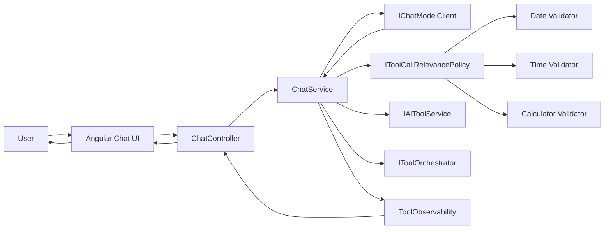

# Learning Guide 05A: Tool-Call Relevance and Basic Observability

This guide explains the hardening step after basic tool calling: validate model-requested tool calls against user intent, avoid unsafe fallback behavior, and expose decision details back to users.

The focus is practical reliability: why a tool did or did not run, and how to avoid accidental tool execution when model tool calls are irrelevant.

## 1. Scope

This milestone implements:

1. Tool-call relevance policy and per-tool validators.
2. Request-level tool ID normalization before tool resolution.
3. Guardrail behavior to skip deterministic fallback when model already issued tool calls.
4. Follow-up model response path when providers return only tool calls with empty assistant text.
5. Observability payload across backend API, stream done events, and frontend rendering.
6. Centralized provider-friendly error messages for Gemini and Ollama paths.

## 2. Learning Outcomes

By the end of this guide, you should be able to explain:

1. How tool calls are validated before execution.
2. How the orchestration path differs between AI-selected tool usage and deterministic fallback.
3. Why fallback is blocked after rejected model tool calls.
4. How observability fields are assembled and surfaced in the UI.
5. How provider error-message centralization improves consistency and testing.

## 3. Big Picture Flow



Key principle: treat model tool calls as untrusted suggestions that must pass explicit policy checks.

## 4. Repository Map for This Milestone

### Orchestration and contracts

1. [backend/src/Chatbot.Application/Chat/ChatService.cs](../backend/src/Chatbot.Application/Chat/ChatService.cs)
2. [backend/src/Chatbot.Application/Chat/ChatResponse.cs](../backend/src/Chatbot.Application/Chat/ChatResponse.cs)
3. [backend/src/Chatbot.Application/Chat/ChatMetrics.cs](../backend/src/Chatbot.Application/Chat/ChatMetrics.cs)
4. [backend/src/Chatbot.Api/Controllers/ChatController.cs](../backend/src/Chatbot.Api/Controllers/ChatController.cs)

### Tool-call relevance policy

1. [backend/src/Chatbot.Application/Tools/IToolCallRelevancePolicy.cs](../backend/src/Chatbot.Application/Tools/IToolCallRelevancePolicy.cs)
2. [backend/src/Chatbot.Application/Tools/IToolCallRelevanceValidator.cs](../backend/src/Chatbot.Application/Tools/IToolCallRelevanceValidator.cs)
3. [backend/src/Chatbot.Application/Tools/ToolCallRelevancePolicy.cs](../backend/src/Chatbot.Application/Tools/ToolCallRelevancePolicy.cs)
4. [backend/src/Chatbot.Application/Tools/DateToolCallRelevanceValidator.cs](../backend/src/Chatbot.Application/Tools/DateToolCallRelevanceValidator.cs)
5. [backend/src/Chatbot.Application/Tools/TimeToolCallRelevanceValidator.cs](../backend/src/Chatbot.Application/Tools/TimeToolCallRelevanceValidator.cs)
6. [backend/src/Chatbot.Application/Tools/CalculatorToolCallRelevanceValidator.cs](../backend/src/Chatbot.Application/Tools/CalculatorToolCallRelevanceValidator.cs)
7. [backend/src/Chatbot.Application/Tools/IAiToolService.cs](../backend/src/Chatbot.Application/Tools/IAiToolService.cs)
8. [backend/src/Chatbot.Application/Tools/SemanticKernelAiToolService.cs](../backend/src/Chatbot.Application/Tools/SemanticKernelAiToolService.cs)

### Dependency registration and provider messaging

1. [backend/src/Chatbot.Infrastructure/DependencyInjection.cs](../backend/src/Chatbot.Infrastructure/DependencyInjection.cs)
2. [backend/src/Chatbot.Infrastructure/ProviderErrorMessages.cs](../backend/src/Chatbot.Infrastructure/ProviderErrorMessages.cs)
3. [backend/src/Chatbot.Infrastructure/Gemini/GeminiChatModelClient.cs](../backend/src/Chatbot.Infrastructure/Gemini/GeminiChatModelClient.cs)
4. [backend/src/Chatbot.Infrastructure/Ollama/OllamaChatModelClient.cs](../backend/src/Chatbot.Infrastructure/Ollama/OllamaChatModelClient.cs)

### Frontend observability rendering

1. [frontend/chatbot-ui/src/app/chat-api.service.ts](../frontend/chatbot-ui/src/app/chat-api.service.ts)
2. [frontend/chatbot-ui/src/app/app.ts](../frontend/chatbot-ui/src/app/app.ts)
3. [frontend/chatbot-ui/src/app/app.html](../frontend/chatbot-ui/src/app/app.html)
4. [frontend/chatbot-ui/src/app/app.scss](../frontend/chatbot-ui/src/app/app.scss)

### Tests

1. [backend/tests/Chatbot.Tests/ChatServiceTests.cs](../backend/tests/Chatbot.Tests/ChatServiceTests.cs)
2. [backend/tests/Chatbot.Tests/GeminiChatModelClientTests.cs](../backend/tests/Chatbot.Tests/GeminiChatModelClientTests.cs)
3. [backend/tests/Chatbot.Tests/OllamaChatModelClientTests.cs](../backend/tests/Chatbot.Tests/OllamaChatModelClientTests.cs)

## 5. Observability Contract

The response now carries a structured object instead of only usedToolId.

ToolObservability fields:

1. decisionSource: ai, deterministic-fallback, or none.
2. summary: short explanation of what happened.
3. steps: compact trace of decision steps.
4. notUsedReason: why no tool executed.
5. usedToolId: tool ID when execution happened.
6. enabledToolIds: final enabled tool set used during decision.

Both JSON response and SSE done events include this object.

## 6. Tool-Call Relevance Policy

Every model tool call is validated by:

1. Tool ID must exist and be enabled.
2. Arguments JSON must parse and match required parameter types.
3. Optional per-tool relevance validator must approve user-intent fit.

Examples:

1. Date tool requires date or today intent.
2. Time tool requires time or clock intent.
3. Calculator tool requires calculator wording or arithmetic pattern with operators.

If validation fails, the call is rejected and recorded in observability notUsedReason and steps.

## 7. Execution Behavior Changes

Updated orchestration order:

1. Send request with enabled tool definitions to model.
2. If model returns tool calls, validate each call and try execution.
3. If a validated call executes, return tool output with decisionSource=ai.
4. Deterministic fallback runs only when tools are enabled and model returned no tool calls.
5. If model returned only tool calls and no text response, request one follow-up model answer with tools disabled.
6. If still no tool execution, return model text with decisionSource=none and reasons.

This avoids a previous risk where rejected model calls could silently trigger unrelated deterministic fallback.

## 8. Frontend Experience

Assistant messages now include expandable details panel when metrics or decision details exist:

1. Token metrics.
2. Tool used, if any.
3. Decision source label.
4. Summary and reason text.
5. Decision step list.

This keeps the main response clean while exposing debug-grade context on demand.

## 9. Dependency Injection Strategy

Infrastructure now discovers implementations by assembly scanning for:

1. IDeterministicChatTool
2. IToolCallRelevanceValidator

Benefits:

1. Less manual registration when adding new tools/validators.
2. Fewer DI oversights during feature expansion.

## 10. Provider Error Message Consolidation

Gemini and Ollama user-facing fallback messages are centralized in one helper.

Benefits:

1. Consistent wording across sync and stream paths.
2. Easier targeted tests for specific status/failure modes.
3. Cleaner provider clients with less duplicated string logic.

## 11. Suggested Manual Demo

1. Start stack from repository root:

```bash
node scripts/start-dev-stack.mjs
```

2. Open http://localhost:4200.
3. Select Gemini and enable Date tool only.
4. Send: who was the last president?
5. Expand response details and confirm decisionSource is No tool executed with a rejection reason.
6. Send: what is the date today?
7. Expand response details and confirm tool execution with decisionSource AI selected tool.
8. For quota/error messaging, force a known provider error path and verify user-friendly fallback text.

## 12. Suggested Validation Checklist

1. SSE done event contains observability object when tools are enabled.
2. Rejected tool calls do not execute deterministic fallback.
3. Empty-text plus tool-call response triggers one follow-up plain model request.
4. Date/time tools do not execute for unrelated user prompts.
5. Calculator relevance still works for explicit arithmetic prompts.
6. Gemini 429 and Ollama not-found/timeout/unavailable messages are user-friendly and deterministic.

## 13. What to Remember

1. Tool call safety starts at validation, not execution.
2. Fallback should be predictable, not surprising.
3. Observability should explain decisions without cluttering primary UX.
4. Consistent error copy is part of reliability engineering.

## 14. Reading Resources

1. Function calling concepts in Semantic Kernel: https://learn.microsoft.com/semantic-kernel/concepts/ai-services/chat-completion/function-calling/
2. Google Gemini API docs: https://ai.google.dev/gemini-api/docs
3. Ollama API docs: https://github.com/ollama/ollama/blob/main/docs/api.md
